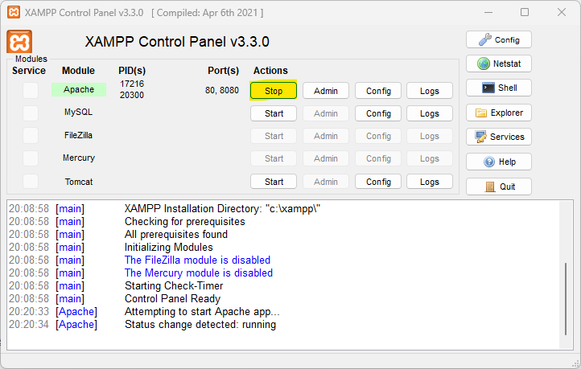
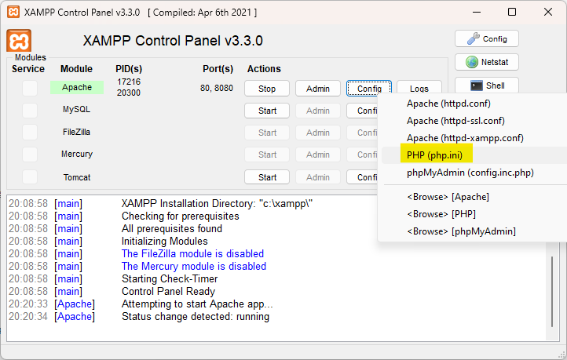
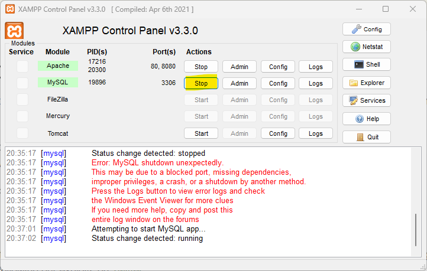
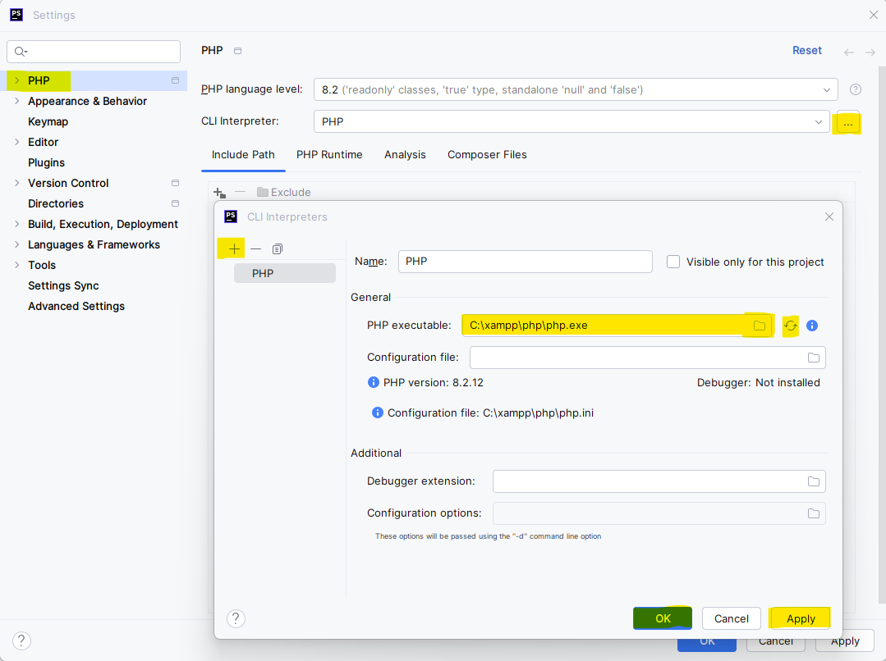

# WPRG
## Warsztaty programistyczne - PHP

### Zagadnienia
- Zjazd_01:
tablice
- Zjazd_02:
formularze
- Zjazd_03:
pliki, katalogi, data i czas
- Zjazd_04:
cookies, sesje, mail
- Zjazd_05:
bazy danych
- Zjazd_06:
programowanie obiektowe

## XAMPP
- Wybrać wersję `xampp-portable-windows-x64-8.2.12-0-VS16.zip` [Link do strony pobierania](https://sourceforge.net/projects/xampp/files/XAMPP%20Windows/8.2.12/)
- Wypakować do `C:\xampp`
- Uruchomić `C:\xampp\setup_xampp.bat`
- Uruchomić `C:\xampp\xampp-control.exe`
- 
- W pliku `httpd-ssl.conf`zmienić `Listen 443` na `Listen 880`
- Kliknać na Action `Start` obok Module `Apache`
- 
- Zmienić ścieżki lokalizacji folderu xampp w `PHP(php.ini)`
- - 
  - **extension_dir = "C:\xampp\php\ext"**
  - **browscap = "C:\xampp\php\extras\browscap.ini"**
- Kliknać na Action `Start` obok Module `MySQL`
- 
- Po poprawnym działaniu można sprawdzić status **serwera XAMPP**:
  - http://localhost/dashboard/ lub http://localhost:8080/dashboard/ , czyli można też wskazać port lokalny serwera
- Stan **bazy MySQL w panelu phpMyAdmin**:
  - http://localhost:8080/phpmyadmin/ , czyli panel z bazą MySQL

## PhpStorm
- Użyć kombinacji skrótów `Alt` + `Ctrl` + `s` w projekcie PhpStorm
- Konfiguracja lokalnego interpretera:
- 
- Konfiguracja debugera:
  - [https://xdebug.org/wizard](https://xdebug.org/download/historical)
  - Xdebug 3.3.2:
  - https://xdebug.org/files/php_xdebug-3.3.2-8.2-vs16-nts-x86_64.dll
  - Pobrany plik umieścić w `C:\xampp\php\ext`
  - W php.ini dodać:
```php
[Xdebug]
zend_extension = "C:\xampp\php\ext\php_xdebug-3.3.2-8.2-vs16-nts-x86_64.dll"
xdebug.remote_enable = 1
```

